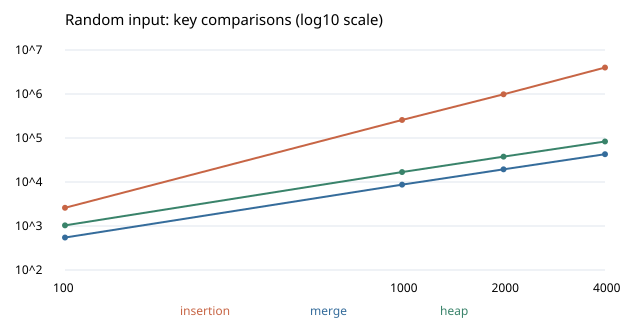

## 과제 1. Compare sorting

삽입 정렬 · 병합 정렬 · 힙 정렬  
장다혜 | 2025193117 | 지능형반도체공학과  
작성일: 2026년 9월 30일

GitHub 저장소: [https://github.com/what1234321/advanced-algorithm-hw1.git](https://github.com/what1234321/advanced-algorithm-hw1)

### 1. 비교 목적과 알고리즘 선택

수업에서 배운 삽입 정렬과 병합 정렬, 새로 학습한 힙 정렬을 비교한다. 삽입은 입력의 정렬 상태에 민감하고, 병합은 안정성을 유지하면서 O(n log n)을 보장한다. 힙은 최악 O(n log n)을 유지하며 보조 배열을 사용하지 않는다. 이 차이를 동일한 입력의 비교 횟수와 실행 시간으로 살펴본다.

### 2. 알고리즘 원리와 이론적 특성

삽입 정렬: 정렬된 앞부분에 새 값을 끼워 넣는다. 새 값보다 큰 원소를 오른쪽으로 밀며, 같은 값에서는 멈추므로 상대 순서가 유지된다.

병합 정렬: 배열을 반으로 나누어 각각 정렬하고 두 정렬된 구간을 합친다. 두 구간의 앞 원소를 비교해 작은 쪽을 먼저 선택한다. 같은 값이면 왼쪽을 먼저 선택하여 안정성을 유지한다.

힙 정렬: 배열을 최대 힙으로 만든 뒤 루트의 최댓값을 배열 끝으로 옮긴다. 힙 범위를 줄이고 부모·자식 관계를 복구하는 과정을 반복한다.

정렬 | 최선 | 평균 | 최악 | 보조 공간 | 안정성
--- | --- | --- | --- | --- | ---
삽입 | O(n) | O(n²) | O(n²) | O(1) | 안정
병합 | O(n log n) | O(n log n) | O(n log n) | O(n) | 안정
힙 | O(n log n)* | O(n log n) | O(n log n) | O(1) | 불안정

* 힙의 최선은 서로 다른 키를 기준으로 한 일반적인 경계이다. 이 구현에 모두 같은 키를 넣으면 sift-down이 바로 종료되어 O(n)이 된다. 공간은 입력 배열을 제외한 알고리즘의 보조 공간이다. 병합의 재귀 스택 O(log n)을 더해도 총 보조 공간은 O(n)이다.

---

## 코드 구성과 검증

### 3. 수업 템플릿 적용

교수님의 algorithm-env에서 Dockerfile, compose.yml, .devcontainer, .vscode 설정과 Makefile 구조를 가져왔다. 예제 버블 정렬을 본 과제의 삽입·병합·힙 정렬로 교체하고, C와 Python에 같은 알고리즘과 비교 계수 규칙을 적용했다. Python에서 생성한 입력 파일을 C도 읽으므로 두 언어가 같은 데이터를 사용한다.

파일 | 역할
--- | ---
src/sort.h · sort.c · sort.py | 정렬 구현과 알고리즘 등록 표
src/main.c · main.py | 공통 실험, 시간 측정, 정답 검증, CSV 출력
tests/test_sort.c · test_sort.py | 기본 입력·크기별 경계·안정성 검증
results/ | 언어별 측정값과 공유 입력 파일
tools/plot.py · report/ | 표준 모듈 SVG 생성기, 그래프, 보고서

각 정렬은 전달받은 배열의 내용을 수정하고 키 비교 횟수를 반환한다. 병합은 별도의 보조 배열을 쓰므로 공간복잡도 의미의 제자리 정렬은 아니다. C는 SORT_ALGORITHMS의 함수 포인터, Python은 SORTS 딕셔너리를 순회하여 호출한다. 알고리즘별로 측정 코드를 따로 만들지 않아 입력 복사와 시간 측정 위치가 동일하다.

### 4. 검증 결과와 실행 환경

검사 | 실제 확인한 결과
--- | ---
make test: C | 616 checks, 0 failures. n=0~200, 500개 표준 qsort 대조, 정렬·역순·동일 키·안정성 반례 및 원소·태그 보존 확인
make test: Python | 3개 테스트 메서드 통과. 기본 7종 입력, n=0~200, 태그 보존과 안정성 확인
make run | 언어별 48개 조건을 각 5회 실행. 모든 출력이 표준 정렬 결과와 일치
C/Python 대조 | 48개 조건 모두 키 비교 횟수 일치

실행 환경은 Linux x86_64, GCC 13.3.0, Python 3.12.14이다. C는 -std=c17 -Wall -Wextra -O2로 컴파일했으며 경고가 없었다. 이번 검증은 호스트에서 수행했고 Docker/Codespaces 실행 자체는 검증하지 않았다. 정렬·테스트·SVG 생성 코드는 외부 라이브러리를 사용하지 않는다.

실행: make test → make run → make charts. 추가 이해 검증은 make understand로 재현한다. make run은 Python 실험 후 C 실험을 수행한다. 언어별로 실행하려면 make run-py, make run-c를 사용한다.

---

## AI를 활용한 새 정렬 학습

### 5. 힙 정렬의 구조와 절차

학습 주제는 “최대 힙을 배열로 어떻게 표현하는가, 왜 전체 정렬은 O(n log n)인가, 왜 안정 정렬이 아닌가”이다. AI를 개념 설명·구현·검증 보조에 활용했다. 설명의 근거는 Wikipedia와 본 과제의 코드 실행 결과로 확인했고, 추가 질문은 재현 가능한 실험으로 점검했다.

최대 힙: 완전 이진 트리를 배열로 표현하며 모든 부모의 값이 자식보다 크거나 같다. 0부터 시작하는 인덱스에서 i번 부모의 자식은 2i+1과 2i+2이다. 루트 a[0]은 힙 전체의 최댓값이지만, 나머지 배열이 오름차순으로 정렬되어 있다는 뜻은 아니다.

구축: 마지막 부모 n//2-1부터 루트까지 역순으로 sift-down한다. 이미 힙인 자식 구간을 이용하여 부모 값을 적절한 위치로 내린다. 큰 두 자식 중 더 큰 쪽과 부모를 비교하여 필요하면 교환한다.

추출: 루트와 힙의 마지막 원소를 교환한다. 배열 끝의 최댓값을 정렬 완료 구간으로 제외하고, 새 루트를 sift-down하여 남은 힙을 복구한다.

입력 [4, 1, 3, 2]의 단계 | 배열 상태
--- | ---
최대 힙 구축 | [4, 2, 3, 1]
4 확정 후 힙 복구 | [3, 2, 1 \| 4]
3 확정 후 힙 복구 | [2, 1 \| 3, 4]
2 확정, 정렬 완료 | [1 \| 2, 3, 4]

### AI 학습 기록 요약

질문 | AI 설명에서 확인한 핵심 | 직접 확인한 방법
--- | --- | ---
왜 bottom-up 힙 구축은 O(n)인가? | 모든 노드가 log n만큼 내려가는 것이 아니라 대부분의 노드는 높이가 매우 낮아 총합이 선형이 된다. | 높이별 노드 수와 sift-down 비용을 급수로 정리했다.
왜 힙 정렬은 불안정한가? | 루트와 끝 원소를 교환하고 sift-down하는 과정에서 같은 키의 상대 순서가 보존되지 않을 수 있다. | 같은 키 네 개에 입력 순서 태그를 붙여 실제 출력 순서를 확인했다.
모든 값이 같으면 왜 비교 횟수가 선형인가? | 자식과 부모가 같아 sift-down이 한 단계에서 바로 멈추기 때문이다. | n=1000 동일 키 입력에서 힙 비교 횟수 2994회를 측정했다.

### 6. 복잡도와 안정성의 이유

힙 높이는 O(log n)이므로 한 번의 sift-down은 O(log n)이다. 바닥에서부터 힙을 구축할 때는 대부분 노드의 높이가 낮아 총 비용이 O(n)이다. 높이 h인 노드 수가 대략 n/2^(h+1)이므로 높이별 비용 합은 n × (1/4 + 2/8 + 3/16 + ...) = O(n)이다. 이후 최대 n-1번 추출에 O(n log n)이 들며 전체도 O(n log n)이다.

삽입과 힙은 반복문 및 고정된 수의 변수로 동작한다. 병합은 C에서 Record n개를 위한 임시 배열과 재귀 스택을 사용한다. Python 병합에는 임시 리스트와 슬라이스도 있지만, 동시에 필요한 공간의 차수는 O(n)이다. 실제 메모리 바이트 수는 측정하지 않았다.

안정성은 같은 키의 입력 순서를 태그로 표시하여 확인했다. 동일 키 네 개의 태그 [0,1,2,3]을 힙으로 정렬하면 [1,2,3,0]이 되어 순서가 바뀐다. 삽입과 병합은 중복 키 테스트에서 태그 순서를 유지했다. 불안정하다는 것은 모든 입력에서 순서가 바뀐다는 뜻이 아니라, 보존을 보장하지 않는다는 뜻이다.

---

## 비교 실험과 측정 결과

### 7. 실험 방법

n=100, 1000, 2000, 4000에 대해 정렬·역순·무작위 순열·중복많음의 네 입력을 사용했다. 무작위는 random.Random(20260930+n)의 shuffle, 중복많음은 같은 시드로 0~9에서 생성한다. 모든 정렬에 같은 원본의 복사본을 전달했다.

각 조건을 5회 실행하여 시간 중앙값(ms)을 기록했다. 입력 복사·파일 입출력·정답 검증은 시간 측정에서 제외했다. 비교 횟수는 키와 키의 비교만 세며 반복·인덱스 조건은 세지 않는다. Python은 perf_counter_ns()의 벽시계 시간, C는 clock()의 CPU 시간을 사용하므로 언어 사이의 시간 비율을 직접 성능 결론으로 사용하지 않는다.

### 8. 입력 모양별 결과 (n=4000)

입력 | 정렬 | 키 비교 횟수 | C 시간(ms) | Python 시간(ms)
--- | --- | --- | --- | ---
정렬 | 삽입 | 3,999 | 0.0030 | 0.4133
정렬 | 병합 | 23,728 | 0.0980 | 5.8797
정렬 | 힙 | 86,576 | 0.2860 | 12.0468
역순 | 삽입 | 7,998,000 | 9.0720 | 771.5351
역순 | 병합 | 24,176 | 0.1580 | 5.1479
역순 | 힙 | 80,151 | 0.2290 | 8.0506
무작위 | 삽입 | 3,992,817 | 3.1180 | 393.1266
무작위 | 병합 | 42,832 | 0.3850 | 9.5053
무작위 | 힙 | 83,392 | 0.4020 | 18.9646
중복많음 | 삽입 | 3,628,132 | 3.4340 | 293.1146
중복많음 | 병합 | 41,624 | 0.2450 | 6.9299
중복많음 | 힙 | 77,413 | 0.2670 | 7.7924

정렬 입력에서 삽입은 n-1=3999회만 비교한다. 역순에서는 n(n-1)/2=7,998,000회로 증가한다. 반면 병합과 힙은 입력 모양에 따라 수치가 달라지지만 비교 횟수가 훨씬 적다. 중복이 많은 입력에서도 세 알고리즘의 출력은 모두 정확했다.

삽입은 정렬된 입력에서 조기 종료하여 빠르다. 병합은 이번 무작위 입력에서 힙보다 비교 횟수가 적었다. Python에서는 실행 시간도 분명히 짧았고, C에서는 0.3850ms와 0.4020ms로 차이가 작아 실행 시간 자체보다는 비교 횟수 차이를 중심으로 해석했다. 이는 이번 구현과 측정 환경의 결과이며 모든 구현·기계의 보편적인 순위를 뜻하지 않는다.

---

## 추가 질문을 코드로 확인하기

### 9. 원소 두 개만 바꿔도 같은 난이도일까?

정렬된 1000개 배열에서 첫 두 원소, 가운데 두 원소, 양끝 두 원소를 각각 한 번 교환했다. 세 경우 모두 바뀐 위치는 두 개지만 삽입 정렬의 작업량은 달랐다. 정렬 상태를 단순히 바뀐 위치의 개수로 설명할 수 있는지 확인하려는 실험이다.

입력 | 역전 쌍 I | 맨 앞까지 이동 r | 삽입 비교 C
--- | --- | --- | ---
정렬 | 0 | 0 | 999
첫 두 원소 교환 | 1 | 1 | 999
가운데 두 원소 교환 | 1 | 0 | 1000
양끝 교환 | 1997 | 2 | 2994
역순 | 499500 | 999 | 499500

역전 쌍은 i가 j보다 앞인데 a[i]가 a[j]보다 큰 경우이다. 양끝을 교환하면 최댓값이 앞에 와서 999개의 역전 쌍을 만들고, 맨 뒤의 최솟값도 999개를 만든다. 양끝끼리의 한 쌍이 두 번 세어지므로 I=999+999-1=1997이다. 가운데 이웃 두 값만 교환한 경우에는 I=1이다.

삽입 정렬에서 한 칸 밀기는 역전 쌍 하나를 해소한다. 여기에 삽입마다 멈추기 위한 비교가 한 번씩 더해지지만, 배열 맨 앞까지 간 경우에는 인덱스 조건으로 끝나서 그 비교가 없다. 따라서 이 구현의 정확한 비교 횟수는 C = I + (n-1) - r이다. r은 새 키가 앞의 모든 값보다 작아 맨 앞까지 들어간 횟수이다. 위 표의 모든 행은 이 식과 일치했다.

첫 두 원소를 교환해도 비교가 999회인 점도 주의할 만하다. 한 번의 밀기는 생겼지만 종료 비교 한 번이 빠져 총 비교 수는 같다. 즉 비교 횟수가 같다고 이동량이나 실행 과정까지 같다는 뜻은 아니다.

### 10. 안정성과 힙의 예외를 따로 확인

삽입의 종료 조건과 병합의 왼쪽 선택 조건을 각각 <=에서 <로 바꾸는 변이 실험을 했다. 입력 (2,0),(1,1),(2,2),(1,3)은 두 변이에서 모두 키가 [1,1,2,2]로 정렬되지만 태그는 [3,1,2,0]이 되어 동등한 키의 순서를 뒤집었다. 기존 안정성 테스트가 두 변이를 모두 검출했다. 변경은 임시 함수에만 적용하여 제출 구현에는 반영하지 않았다.

모든 키가 같은 n=1000 입력에서는 힙 비교가 2994회였다. 자식과 부모가 같으면 sift-down이 즉시 멈추므로 이 경우는 선형 비용이다. 따라서 힙의 최선 O(n log n) 표에는 서로 다른 키라는 조건을 붙였다. 단순한 복잡도 표도 입력 가정과 함께 읽어야 한다.

재현: make understand. 원자료는 results/understanding.csv와 results/mutation.json이다. 이 검증은 Python 비교 횟수를 이용하며, 역전 쌍을 직접 세는 분석 비용은 정렬 시간 실험에 포함하지 않는다.

---

## 입력 크기에 따른 변화와 결론

### 11. 무작위 입력의 비교 횟수 증가

n | 삽입 | 병합 | 힙
--- | --- | --- | ---
1000 | 256,911 | 8,709 | 16,827
2000 | 984,459 | 19,409 | 37,693
4000 | 3,992,817 | 42,832 | 83,392

그림: 무작위 입력의 키 비교 횟수. 가로축과 세로축은 로그 축이며, 원자료는 results/benchmark.csv이다. 작은 값도 표시하기 위해 로그 축을 사용했다.

n이 두 배가 될 때 삽입의 비교는 3.83배, 4.06배로 약 4배 증가했다. 병합은 2.23배, 2.21배, 힙은 2.24배, 2.21배로 약 2배보다 조금 크게 증가했다. 이는 각각 n²와 n log n의 증가 양상과 부합한다. 유한한 크기의 실험만으로 복잡도를 증명하는 것은 아니다.

### 12. 결론과 한계

거의 정렬된 작은 배열은 삽입 정렬, 안정성이 필요하고 O(n) 보조 공간을 허용할 수 있으면 병합 정렬, 안정성이 필요하지 않으면서 O(1) 보조 공간과 최악 O(n log n)을 요구하면 힙 정렬을 선택할 수 있다. 실행 시간은 부하·언어·최적화의 영향을 받으므로 비교 횟수 및 입력 조건과 함께 해석해야 한다.

### 13. 참고 자료

① 이태규, 고급알고리즘 「주제 02. 기본 정렬」 및 「주제 03. 분할 정복과 머지 정렬」, 첨부 PDF.  
② 수업 템플릿: https://github.com/lec-algorithm/algorithm-env  
③ 교수님 샘플 보고서: https://github.com/lec-algorithm/hw1-sample-2026/blob/main/report/REPORT.md  
④ 정렬 비교 표: https://en.wikipedia.org/wiki/Sorting_algorithm#Comparison_of_algorithms  
⑤ 힙 정렬: https://en.wikipedia.org/wiki/Heapsort
